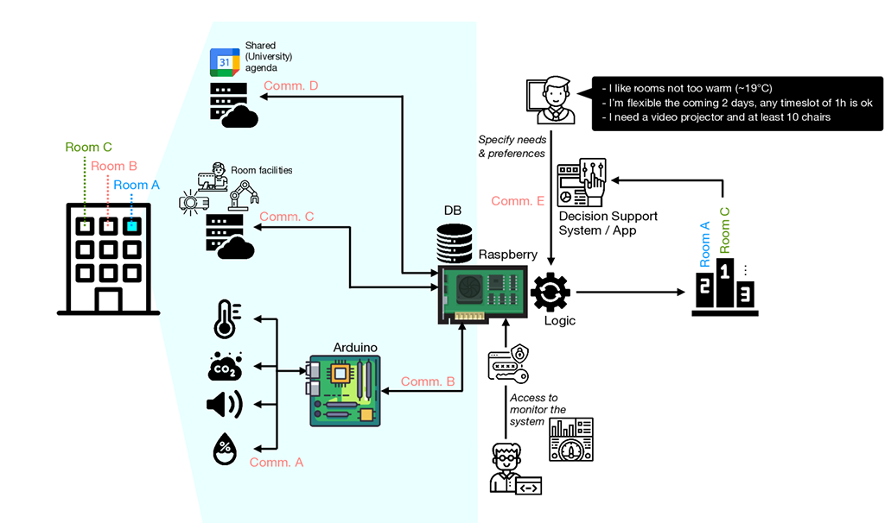
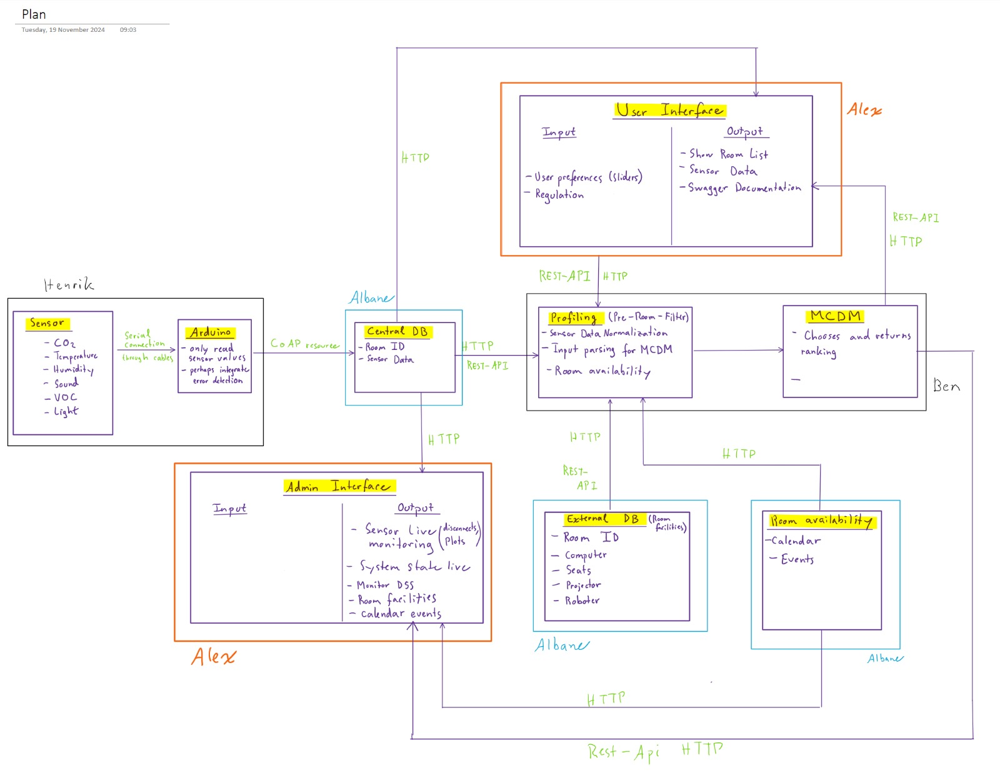

# IOT Project

### Network


### Protocol usage

-- DRAFT --

- Commlink A: Serial connection
- Commlink B: MQTT (depending on Arduino Version, MQTT client already on Arduino, transmission via WiFi to Broker, then central logic unit as client subscribed to Commlink B)
- Commlink C/D/E: HTTP

### Workplace criteria

[EU regulations](https://eur-lex.europa.eu/eli/dir/1989/654/)

### 

# IOT_Project_Arduino_Controller

# IOT_Project_Database

## Required libraries:

#### Google Calendar API
```pip install --upgrade google-api-python-client google-auth-httplib2 google-auth-oauthlib```

#### Get access to Api Credentials
```pip install python-dotenv```
### Requirements/Project definitions

